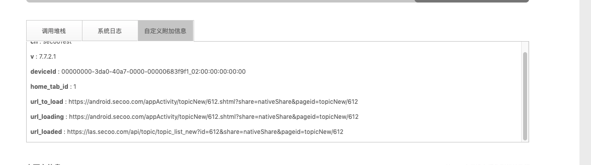

### 收集崩溃现场数据的意义

  * 更好的重现问题和验证问题

  * 为修复问题提供帮助

  * 从长远角度来看，增强了应用的稳定性

### 哪些可以作为现场数据

  * url_to_load  首次加载的url    

  * url_loaded   已经加载完成的url  

  * keyword  最后一次搜索的关键字  

  * orderId 最后一次订单的id

  * categoryId  分类id

  * tabId 当前首页的tabid 

  * product_id 商品id

  * commitHash apk包编译时的代码版本

  * paymentMethod  支付方式

  * v_clk  当前点击的view的名称

  * rcnt_actvt  最近的activity列表

  * actvt_cnt  activity的数量
  
  * 其他业务场景关联，对解决崩溃问题有帮助的字段


### 如何收集

  * 关于收集现场奔溃数据，我们提供了主动式与被动式两种方案。

  * 优先建议使用被动式方案(仅限Activity和Fragment中)

  * 如果想要急于收集现场数据，可以采用主动式上报方案。

#### 被动提供数据

目前，已经针对了基础的Fragment和Activity做了处理

  * 使用`supplySpotData(key, value)`提供现场数据的key和value值即可
  
  * Fragment会在`onFragmentVisibleToUser`(Fragment人为可见)和`onFragmentInvisibleToUser`(Fragment人为不可见)时提交现场数据

  * Activity会在`onResume`和`onPause`时提交现场数据

代码示例

```java
private void initHttp() {
        Intent mIntent = getIntent();
        productid = mIntent.getStringExtra("productid");
        supplySpotData(SpotDataKey.KEY_PRODUCT_ID, productid);

        brandid = mIntent.getStringExtra("brandid");
}
```

#### 主动请求现场数据收集

  * 主动式上报适用范围广，时机可以控制。

代码示例

```java
CrashDetective.reportCrashSpotData("isForTest", "true")
```

### 现场数据时如何工作的

  * 崩溃现场数据的收集主要依赖于听云的`NBSAppAgent.setUserCrashMessage(spotDataKey, spotDataValue)`字段。

  * 设置好崩溃现场数据后，听云会自动的将发生的崩溃与这些数据关联，发送到崩溃后台。


### 如何查看关联的现场数据

选择一个崩溃，进入崩溃详情，查看如下图的自定义附加信息Tab



#### 基础字段说明

这里我们目前增加的一些基础字段。

```kotlin
@file:JvmName("SpotDataKey")
package com.secoo.commonsdk.crash

/**
 * 初始加载的url，考虑到可能未收到 KEY_URL_LOADED 之前可能发生崩溃，所以需要记录
 */
const val KEY_URL_TO_LOAD = "url_to_load"

/**
 * 加载完成的URL，不完全等同于KEY_URL_TO_LOAD（一个webview加载多次的情况下）
 */
const val KEY_URL_LOADED = "url_loaded"

/**
 * 用户点击链接后的URL，不完全等同于KEY_URL_LOADED,可能会包含部分deepLink
 */
const val KEY_URL_LOADING = "url_loading"

/**
 * 商品搜索关键字
 */
const val KEY_SERACH_KEYWORD = "search_keyword"

/**
 *  订单id，收银台和订单详情可能用到
 */
const val KEY_ORDER_ID = "order_id"

/**
 * 商品id
 */
const val KEY_PRODUCT_ID = "product_id"

/**
 * 首页的Tab位置
 */
const val KEY_HOME_TAB_ID = "home_tab_id"

/**
 * 渠道信息，使用ch作为值，保持与之前一样
 */
const val KEY_CHANNEL = "ch"

/**
 * 版本名称信息,使用之前的值
 */

const val KEY_VERSION_NAME = "v"

/**
 * 设备id信息
 */
const val KEY_DEVICE_ID = "deviceId"

/**
 * commitHash,在测试环境下对应版本确定崩溃有帮助
 */
const val KEY_COMMIT_HASH = "commit_hash"

```

### TroubleShooting

#### SpotDataKey 没有我想要加的业务字段怎么办

  * 可以增加在SpotDataKey，也可以以字面量形式直接在业务模块增加
