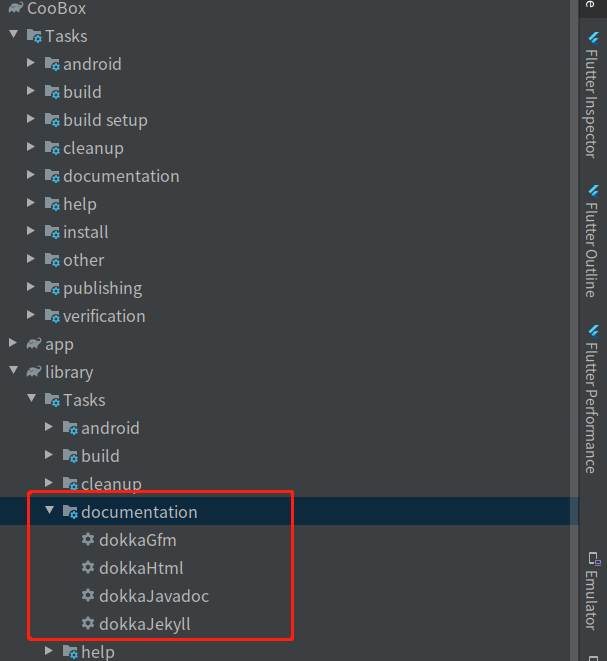
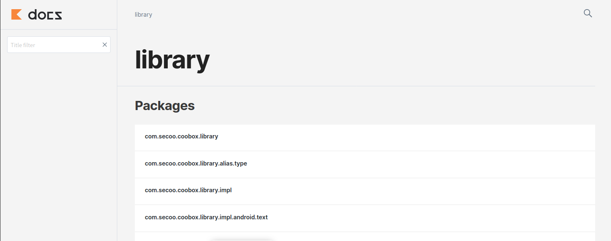
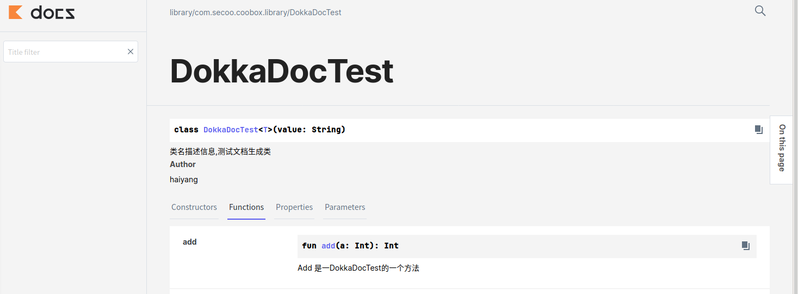
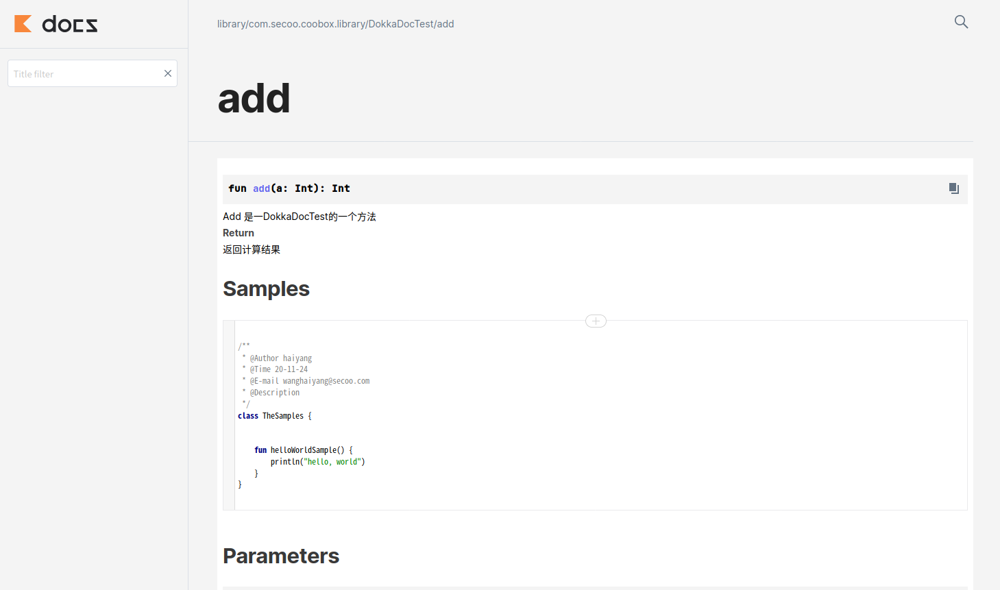

Dokka是Kotlin的文档引擎，执行与Java的javadoc相同的功能。就像Kotlin本身一样，Dokka完全支持Java / Kotlin混合语言项目。

#### Dokka可以生成多种格式的文档:

* Javadoc

* HTML

* Markdown


### 如何在项目中配置Dokka

Dokka目前使用的还是比较少的,官方给的demo也是使用`build.gradle.kts`文件,这是采用了`Gradle Script Kotlin`的替代`Groovy`配置`build.gradle`的一种新的方式,而国内的大多数项目目前还是以`Groovy`为主,所以接下来的配置方式,主要以`Groovy`为主


如果想要配置`Kotlin Script`的方式可以参考[官方例子](https://github.com/Kotlin/kotlin-examples/tree/master/gradle/dokka)


#### (一) 项目中根目录build.gradle下配置

```

 classpath "org.jetbrains.dokka:dokka-gradle-plugin:1.4.10.2"

```

#### (二) 工程目录build.gradle下配置

第一步引入dokka

```
apply plugin: 'org.jetbrains.dokka'

```

最简单配置方式

```
tasks.named("dokkaHtml") {
    outputDirectory.set(new File(rootDir, "dokkadocs"))
}
```
这里只设置了dokka输出目录,这里我们在根目录下生成了`dokkadocs`目录存放我们的生成的文档

当然,这种简单的方式,在实际开发中没有办法满足我们一些扩展需求,我们需要更多dokka的配置选项

我们可以选择`android {}`增加我们的所需要的配置项:

> 如果选择`android {}`配置 之前的简单配置方式就不需要了

```
  dokkaHtml {
        outputDirectory.set(new File(rootDir, "dokkadocs"))

        //设置输出文档的 module
        moduleName.set("library")

        dokkaSourceSets {
            configureEach { // Or source set name, for single-platform the default source sets are `main` and `test`

                // Used to remove a source set from documentation, test source sets are suppressed by default
                suppress.set(false)

                // Use to include or exclude non public members
                includeNonPublic.set(true)

                // Do not output deprecated members. Applies globally, can be overridden by packageOptions
                skipDeprecated.set(true)

                // Emit warnings about not documented members. Applies globally, also can be overridden by packageOptions
                reportUndocumented.set(true)

                // Do not create index pages for empty packages
                skipEmptyPackages.set(true)

                // This name will be shown in the final output
                displayName.set("JVM")

                // Platform used for code analysis. See the "Platforms" section of this readme
                platform.set(org.jetbrains.dokka.Platform.jvm)
                // Used for linking
                // to JDK documentation
                jdkVersion.set(8)
                sourceLink {
                    //项目根目录的相对路径(在其中分别执行gradle),这里我们要执行的library
                    localDirectory.set(file("com/secoo/coobox/library"))

                    // URL showing where the source code can be accessed through the web browser
                    remoteUrl.set(new URL(
                            "https://github.com/cy6erGn0m/vertx3-lang-kotlin/blob/master/src/main/kotlin"))
                    // Suffix which is used to append the line number to the URL. Use #L for GitHub
                    remoteLineSuffix.set("#L")
                }

                // 配置  sample code 的存放目录
                samples.from("$rootDir/library/src/androidTest/java/com/secoo/coobox/library/samples/")
                // Disable linking to online kotlin-stdlib documentation
                noStdlibLink.set(true)

                // Disable linking to online JDK documentation
                noJdkLink.set(false)

                // Disable linking to online Android documentation (only applicable for Android projects)
                noAndroidSdkLink.set(true)

            }
        }
    }

```

### 如何在项目中使用Dokka

根据上面的我们已经完成Dokka的基础配置

(1)就像JavaDoc一样，KDoc注释以开头/**和结尾*/。注释的每一行都可以以星号开头，该星号不被视为注释内容的一部分。

(2)按照规定，文档文本的第一段（直到第一个空白行的文本块）是元素的摘要描述，而后面的文本是详细描述。

(3)每个块标记都以新行开头，并以@字符开头。

#### KDoc当前支持以下块标签：

#### @param <name>

记录函数的值参数或类，属性或函数的类型参数。为了更好地将参数名称与描述分开，可以根据需要将参数名称括在方括号中。因此，以下两种语法是等效的：

* @param name description.

* @param[name] description.

#### @return

记录函数的返回值。

#### @constructor

记录类的主要构造函数。

####  @receiver

记录扩展功能的接收者。

####  @property <name>

记录具有指定名称的类的属性。此标记可用于记录在主构造函数中声明的属性，在该构造函数中，在属性定义之前直接放置doc注释会很尴尬。

####  @throws <class>， @exception <class>

记录可以由方法引发的异常。由于Kotlin没有检查异常，因此也不希望记录所有可能的异常，但是当它为类的用户提供有用的信息时，您仍然可以使用此标记。

####  @sample <identifier>

将具有指定限定名称的函数主体嵌入到当前元素的文档中，以显示如何使用该元素的示例。

####  @see <identifier>

将指向指定类或方法的链接添加到文档的“另请参见”块。

####  @author

指定要记录的元素的作者。

####  @since

指定引入了要记录的元素的软件版本。

####  @suppress

从生成的文档中排除元素。可以用于那些不是模块官方API一部分但仍然必须在外部可见的元素。


这里我们看一个使用示例:

```
**
 *
 * 类名描述信息,测试文档生成类
 * @param T 泛型类型
 * @property value 属性value
 * @constructor 创建DokkaDocTest的构造器.
 * @Author haiyang
 *
 */
class DokkaDocTest<T>(val value: String) {

    /**
     * 属性arg
     */
    val arg1:Int =  0

    /**
     * Add 是一DokkaDocTest的一个方法
     * @param[a] a是方法的入参
     * @sample com.secoo.coobox.library.samples.TheSamples.helloWorldSample
     * @return 返回计算结果
     */
    fun add(a: Int):Int {

        return a
    }


    /**
     * subtract 是一DokkaDocTest的一个方法
     * @param b b是方法的入参
     * @return 返回计算结果
     */
    fun subtract(b:Int):Int {
        return b
    }


}
```
>这里需要注意的是方法add上的一个注解` @sample com.secoo.coobox.library.samples.TheSamples.helloWorldSample`
这是展示了代码示例 而这个代码所属类需要创建在我们之前配置sample code路径下,这个代码可以可以显示一个类的代码,也可以只显示代码方法体的代码,根据需要这自己配置

### 如何生成文档

#### 方式一:使用Android studio右侧的Gradle




这里面有种文档的方式,根据自己需要右键点击`run`就可以了

#### 方式二:使用命令生成文档

```
dokkaGfm - Generates documentation in GitHub flavored markdown format
dokkaHtml - Generates documentation in 'html' format
dokkaJavadoc - Generates documentation in 'javadoc' format
dokkaJekyll - Generates documentation in Jekyll flavored markdown format
```
命令也有四种生成文档的方式,这里我们以dokkaHtml为例执行命令:

> ./gradlew dokkaHtml


### 最终效果图











参考文档

[https://kotlin.github.io/dokka/1.4.20/](https://kotlin.github.io/dokka/1.4.20/)

[https://github.com/Kotlin/dokka](https://github.com/Kotlin/dokka)

[https://kotlinlang.org/docs/reference/kotlin-doc.html](https://kotlinlang.org/docs/reference/kotlin-doc.html)
