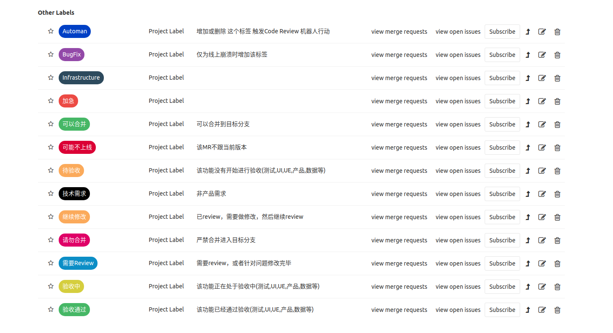

为了更加高效管理Merge Request, 以及充分利用和发挥标签的使用意义，我们这里做了一些简单的约定

目前处于初稿，我们先初步实践，然后后续调整。

## 一个Merge Request 的 阶段

  1. 代码添加或修改,需要进行review

  2. 代码review结束,需要修改

  3. 重复步骤1和步骤2,直到达到可以合并的标准

## 角色

  * MR submitter 负责提交Merge Request,并针对review做修改

  * MR reviewer  负责review Merge Request,提出MR中存在的问题,该角色可以对应多个人

  * MR dispatcher 负责分发MR,修改或增加MR reviewer

  * MR terminator  最终负责MR结果走向的人,比如合并或者关闭

### 注意

  * 上述角色至少需要两个人

  * 因权限问题, MR reviewer 可能无权限合并该MR

## 有哪些标签

### MR:Needs Review(MR:需要Review)

 * 当MR创建或者进行了更新,需要人员Review时,MR submitter 设置该标签

 * 如果MR对应的内容不需要跟版,不需要现在合并的,不要增加该Lable

 * 如果一个MR,当前的label不包含MR:Needs Review,MR reviewer 则不会review

### MR:Reviewed With Comments(MR:需要修改)

  * MR reviewer 进行了review,并提出了一些评论来记录发现的问题和疑问

  * MR reviewer 移除 MR:Needs Review 并添加标签 MR:Reviewed With Comments

  * MR submitter 根据提出的问题和疑问进行修改或回答,当修改完毕后,移除标签 MR:Reviewed With Comments,并设置MR:Needs Review

### Good to Merge(可以合并)

  * 经过上面的来回操作,在某一点,MR达到了一个可以合并的时候,这时候需要移除前面的标签,设置成Good to Merge

  * 设置这个标签,需要由MR reviewer 操作,而不是MR submitter

  * 设置完这个标签后,MR不需要再更新

  * 因MR reviewer不一定有merge权限,这一标签还是有必要的

### Do Not Merge(请勿合并)

  * 禁止合并标签,该MR可以被 review,但是不要合并进来.

  * 适用于未来的需求,目前尚不需要加入到主分支

  * 辅助标签,更加明确表明不需要合并当前MR

### 待验收

  * 该功能没有开始进行验收(测试,UI,UE,产品,数据等)

  * 如果当前MR包含待验收,通常不会被合并

### 验收中

  * 该功能正在处于验收中(测试,UI,UE,产品,数据等)

  * 如果当前MR包含该标签,通常不会被合并

### 验收通过

  * 该功能已经通过验收(测试,UI,UE,产品,数据等)

  * 如果当前MR包含验收通过,可以进行合并

### BugFix

  * 仅用于修复线上版本的崩溃提交时,使用

### 可能不上线

  * 有些MR已经完成,但不确定什么版本引入,需要增加该标签

### 技术需求

  * 非产品迭代需求
  
  
### 最新的标签如下图

