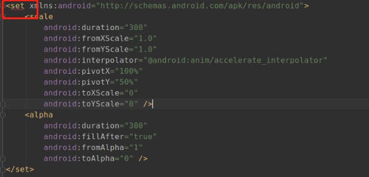
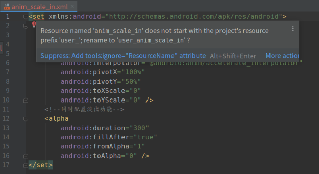

**我们时常在一个组件或者模块化架构项目里看到下面这个错误**




这个是一个平移动画的资源文件，Set标签下报了红，当我们把鼠标放上去会有



> Resource named 'anim_scale_in' does not start with the project's resource prefix 'user'; rename to 'user_anim_scale_in' ?

 这话话大致意思呢我们在需要在命名的文件添加前缀为user_开头，但是也可以通过`Alt+Shift+Enter`来添加`tools:ignore="ResourceName`忽略这个命名错误

不单是在资源文件，我们有的时候也在java或者kotlin 代码中配到一些方法上有一些这样的注解

```javascript
    @SuppressLint("NewApi")
    private void setBackgroundCompat(Drawable drawable) {
        if (Build.VERSION.SDK_INT >= VERSION_CODES.JELLY_BEAN) {
            setBackground(drawable);
        } else {
            setBackgroundDrawable(drawable);
        }
    }
```

其实`NewApi`和`ResourceName` 都是Lint检查问题的一个ID

Lint 其实的 代码扫描工具，lint 工具可以检查您的 Android 项目源文件是否有潜在的错误，以及在正确性、安全性、性能、易用性、无障碍性和国际化方面是否需要优化改进

**检查工具有很多，为什么选择Lint做为一个主要核心**

首先lint能检测内容很全面

## Lint都能检测什么

* Java

* Kotlin

* XML文件

* 图标

* ProGuard 配置文件

Lint 工具完成其检查后，会提供 XML 和 HTML 版 Lint 报告的路径。然后，您可以转到 HTML 报告并在浏览器中将其打开


在某些特殊情况下，系统定义的 Lint 并不能满足我们的需求，这时需要我们自己定义规则，然后利用 Android 的 Lint 工具帮助我们自动发现某些问题

## 如何自定义Lint规则

### 1.首先需要创建一个存放自定义 Lint 代码的module， Lint 我们需要依赖两个库

```javascript
compile 'com.android.tools.lint:lint-api:' + lint_version
compile 'com.android.tools.lint:lint-checks:' + lint_version
```
lint-checks 中包含了所有的官方定义的 lint 规则，我们可以参考其中的 Detector 实现自定义的 Detector 来满足项目的特殊需要，但是关于这方面的资料和文档是十分稀少的，所以这些官方提供的实例非常值得我们深入研究


### 2.Detector

lint 规则实现类需要继承 Detector 并实现 Scanner 接口

    Detector.UastScanner——扫描 Java 源码抽象语法树
    Detector.ClassScanner——扫描 class 文件
    Detector.BinaryResourceScanner——扫描二进制资源文件
    Detector.ResourceFolderScanner——扫描资源文件
    Detector.XmlScanner——扫描xml文件
    Detector.GradleScanner——扫描gradle文件
    Detector.OtherFileScanner——扫描其他类型文件

根据我们的需求实现不同的Detector

### 3.Issue

找到了目标代码，我们需要上报给系统以供展示，Issue 的作用就是在 Detector 发现并报告，由静态方法 create 创建

```javascript

   public static Issue create(String id, String briefDescription, String explanation, Category category, int priority, Severity severity, Implementation implementation)


```
    id : 唯一值，应该能简短描述当前问题。利用Java注解或者XML属性进行屏蔽时，使用的就是这个id。
    summary : 简短的总结，通常5-6个字符，描述问题而不是修复措施。
    explanation : 完整的问题解释和修复建议。
    category : 问题类别。详见下文详述部分。
    priority : 优先级。1-10的数字，10为最重要/最严重。
    severity : 严重级别：Fatal, Error, Warning, Informational, Ignore。
    Implementation : 为Issue和Detector提供映射关系，Detector就是当前Detector。声明扫描检测的范围Scope，Scope用来描述Detector需要分析时需要考虑的文件集，包括：Resource文件或目录、Java文件、Class文件。
我们为 LogUtilDetector 定义了上报的 Issue 如下格式
```javascript

    public static final Issue ISSUE = Issue.create(
            "LogUse",
            "避免使用Log",
            "使用LogUtils，防止在正式包打印log",
            Category.SECURITY, 5, Severity.ERROR,
            new Implementation(LogDetector.class, Scope.JAVA_FILE_SCOPE)
    );

```

[Lint提供检测的ISSUE查询文档](http://tools.android.com/tips/lint-checks) 

最终通过 context.report(ISSUE, node, context.getLocation(node), message); 方法上报，其中 message 就是针对具体代码场景的描述

### 4.我们以一个检测项目中 Log 日志打印的自定义 Detector 为例来说明自定义 Detector 的结构构成

```javascript
public class LogUtilDetector extends Detector implements Detector.JavaPsiScanner {

    public static final Issue ISSUE = Issue.create(
            "LogUtilUse",
            "避免使用Log/System.out.println",
            "使用LogUtil，LogUtil对系统的Log类进行了展示格式、逻辑等封装",
            Category.SECURITY, 5, Severity.WARNING,
            new Implementation(LogUtilDetector.class, Scope.JAVA_FILE_SCOPE));

    public List<String> getApplicableMethodNames() {
        return Arrays.asList("d", "e", "i", "v", "w");
    }

    public void visitMethod(JavaContext context, JavaElementVisitor visitor, PsiMethodCallExpression node, PsiMethod method) {
        JavaEvaluator evaluator = context.getEvaluator();
        if (evaluator.isMemberInClass(method, "android.util.Log")) {
            String message = "请使用LogUtil";
            context.report(ISSUE, node, context.getLocation(node), message);
        }
    }
}
```

### 5.通过IssueRegistry注册

自定义 lint 规则必须提供一个继承自 IssueRegistry 的类，实现抽象方法 public abstract List<Issue> getIssues(); 将所有自定义 Detector 的 Issue 方法放入

```javascript
public class MyIssueRegistry extends IssueRegistry {
    @Override
    public List<Issue> getIssues() {
        return Arrays.asList(
                LogUtilDetector.ISSUE, //示例
    			ErrorHandleSubscriberDetector.ISSUE,
                DeprecatedDetector.ISSUE,
                ConstructorDetector.ISSUE
    }
}
```

## 自定义Detector思考

我们可以自定一些Detector, 但是有一些是很相似的
比如项目中我们经常遇到的废弃或者不能使用的使用类，我们为每一个方法自定义一个Detector是在重复造轮子，如何做到通用呢？
首先在lint的规则中

* 要检测的内容

* 提示纠错内容

而在我们的代码里无论kotlin或者Java我们检测的内容大致分为如下

* 类

* 方法

* 属性字段

而lint检测匹配的内容，是根据被检测者路径来做匹配的
比如Log我们要检测的`java.lang.Thread` 或者`com.google.gson.Gson`

按照这个思路，我们思考一下

比如我们代码中，有很多可能要被替换的方法，通用的可以做一个map

```javascript

    private var constructorMap= mapOf(
           "java.lang.Thread"  to "请用线程池创建线程,避免直接new Thread()",
            "com.google.gson.Gson" to "使用GsonUtil避免重复创建Gson对象",
    )

```

剩下的是其实也很简单，我们按照之前的检测方式用map遍历去匹配规则

这种方式也使用适用于做一个通用检测的方法与字段的，只是匹配规则的方式不同

当然我们还可以通过自定义注解 通过检测对应的注解并提取出 注解的提示这样我们可以在代码中更灵活的运用。
