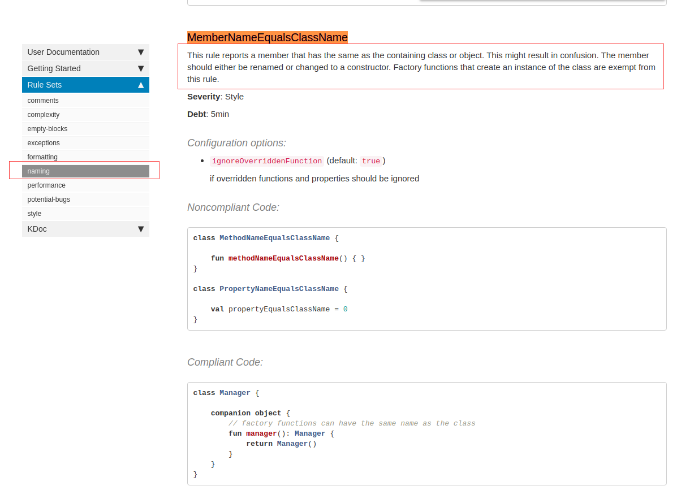

### 下载detekt源码

访问detekt github官网

[https://github.com/arturbosch/detekt/](https://github.com/arturbosch/detekt/)

使用download下载源码或使用git clone 下载源码

### 访问官网
[https://arturbosch.github.io/detekt/cli.html](https://arturbosch.github.io/detekt/cli.html)

访问如上官网，选中Getting Started开始，我们可以看到Detekt给我们提供了五种编译方式
1.  with the Command Line Interface
2.  with Gradle Groovy DSL
3.  with Gradle Kotlin DSL
4.  with Gradle Plain Task
5.  with Maven Ant Task

### 开始编译
我们选用第一种（`命令方式`）编译，进入Terminal， 按以下步骤执行：
1.  cd detekt
2.  gradle build(`如果编译失败，请使用./gradlew build`)
3.  java -jar detekt-cli/build/libs/detekt-cli-[version]-all.jar [parameters]*

我们解释以下第二步和第三步，
`gradle build或./gradlew build`执行编译，在编译成功的情况下，会在 `../detekt/detekt-cli/build/libs/`下生成一个 `detekt-cli-[version]-all.jar`jar文件， 我们通过第三步执行该jar文件

#### [parameters]* 部分解释

--input `project file path` 
--config `project detekt config file(eg：projectFilePath/xxx.yml)  `
--report  `report id (html; xml, txt):report file path（eg：/report/report.html）`

### 实际应用
```
java -jar detekt-cli-1.2.1-all.jar --input ~/gitProjects/SecooComponentMaster/ --config ~/gitProjects/SecooComponentMaster/detektFiles/deteky.yml --report html:detekt.html
```

`parameters`具体参数参数如下
```
Usage: detekt [options]
  Options:
    --auto-correct, -ac
      Allow rules to auto correct code if they support it. The default rule
      sets do NOT support auto correcting and won't change any line in the
      users code base. However custom rules can be written to support auto
      correcting. The additional 'formatting' rule set, added with
      '--plugins', does support it and needs this flag.
      Default: false
    --baseline, -b
      If a baseline xml file is passed in, only new code smells not in the
      baseline are printed in the console.
    --build-upon-default-config
      Preconfigures detekt with a bunch of rules and some opinionated defaults
      for you. Allows additional provided configurations to override the
      defaults.
      Default: false
    --classpath, -cp
      EXPERIMENTAL: Paths where to find user class files and depending jar
      files. Used for type resolution.
    --config, -c
      Path to the config file (path/to/config.yml). Multiple configuration
      files can be specified with ',' or ';' as separator.
    --config-resource, -cr
      Path to the config resource on detekt's classpath (path/to/config.yml).
    --create-baseline, -cb
      Treats current analysis findings as a smell baseline for future detekt
      runs.
      Default: false
    --debug
      Prints extra information about configurations and extensions.
      Default: false
    --disable-default-rulesets, -dd
      Disables default rule sets.Detekt使用命令生成检测日志
      Default: false
    --excludes, -ex
      Globing patterns describing paths to exclude from the analysis.
    --fail-fast
      Same as 'build-upon-default-config' but explicitly running all available
      rules. With this setting only exit code 0 is returned when the analysis
      does not find a single code smell. Additional configuration files can
      override rule properties which includes turning off specific rules.
      Default: false
    --generate-config, -gc
      Export default config to default-detekt-config.yml.
      Default: false
    --help, -h
      Shows the usage.
    --includes, -in
      Globing patterns describing paths to include in the analysis. Useful in
      combination with 'excludes' patterns.
    --input, -i
      Input paths to analyze. Multiple paths are separated by comma. If not
      specified the current working directory is used.
    --language-version
      EXPERIMENTAL: Compatibility mode for Kotlin language version X.Y, reports
      errors for all language features that came out later.
      Default: latest stable
      Possible Values: [1.0, 1.1, 1.2, 1.3, 1.4]
    --jvm-target
      EXPERIMENTAL: Target version of the generated JVM bytecode that was
      generated during compilation and is now being used for type resolution
      Default: 1.6
      Possible Values: [1.6, 1.8, 9, 10, 11, 12]
    --parallel
      Enables parallel compilation of source files. Should only be used if the
      analyzing project has more than ~200 Kotlin files.
      Default: false
    --plugins, -p
      Extra paths to plugin jars separated by ',' or ';'.
    --report, -r
      为给定的“报告ID”生成报告，并将其存储在给定的“path”中。
      条目应包含：[report-id：path]。 可用的“报告ID”值：
       'txt'，'xml'，'html'
      These can also be used in combination with each
      other e.g. '-r txt:reports/detekt.txt -r xml:reports/detekt.xml'
```

### 修改规则

detekt提供了比较完善的规则，具体的规则配置在配置文件`detekt.yml`中，我们可以手动修改规则是否被开启


如上图，我们可以看出提示我们 `成员变量名称和类名一致了`， detekt给我们检测出了这个警告，我们想忽略此警告，我们可以看看对应的detekt规则


我们可以根据上述规则修改一下，找到我们的`detekt.yml`文件， 将`MemberNameEqualsClassName`行为改为false，具体可以看看部分代码
```xml#### 
naming:
  MemberNameEqualsClassName:
    active: false
  VariableNaming:
    active: true
    variablePattern: '[a-z][A-Za-z0-9]*'
    privateVariablePattern: '(_)?[a-z][A-Za-z0-9]*'
    excludeClassPattern: '$^'
  ConstructorParameterNaming:
    active: false
    parameterPattern: '[a-z][A-Za-z0-9]*'

```
再次运行，会发现检测日志中已经忽略了该警告

我们项目中的所有警告都可以通过该方式来设定
